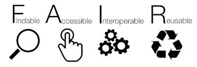

# Data Science Platform

**A starter kit for a data science platform.**

Includes links and descriptions for popular tools, services and resources every
world-class data organization needs in order to manage their data and make data
driven apps and services.

Establishing good data practices early in the organizational transformation is
key. The FAIR data principles are an useful guide to follow.

## FAIR Data

FAIR data are data which meet principles of findability, accessibility,
interoperability, and re-usability.

- [Wikipedia](https://en.wikipedia.org/wiki/FAIR_data)
- [Go FAIR](https://www.go-fair.org/fair-principles/)
- [FAIR Data Principles](https://www.force11.org/group/fairgroup/fairprinciples)

### FAIR Data Management

#### Frictionless Data

*The progressive data toolkit.*

Frictionless Data is a progressive, incrementally adoptable open-source toolkit
that brings simplicity and gracefulness to the data experience - whether you're
wrangling a CSV or engineering complex pipelines with gigabytes.

- [Homepage](https://frictionlessdata.io/) 
- [Github](https://github.com/frictionlessdata) 
  - [Python Module](https://github.com/frictionlessdata/frictionless-py)
  - [How to use.](https://github.com/frictionlessdata/frictionless-py/blob/master/docs/target/getting-started/README.md)
- [Lecture on Frictionless Data](https://www.youtube.com/watch?v=EFQmudQP4io)

#### CKAN

- [CKAN and The Government of Canada](https://ckan.org/team/government-of-canada/)
- [Demo of CKAN](https://demo.ckan.org/)
- [Install CKAN with Docker Compose](https://docs.ckan.org/en/2.9/maintaining/installing/install-from-docker-compose.html)
- [How to use Frictionless Data with CKAN](https://frictionlessdata.io/how-to/how-to-use-data-packages-with-ckan/)

## Graphical Interfaces for ML Apps

### Streamlit

The fastest way to build and share data apps. Turn data scripts into shareable
web apps in minutes. All in Python. All for free. No front-end experience
required.

- [Homepage](https://www.streamlit.io/)

## Development Environments

### Jupyter

https://hub.docker.com/r/cschranz/gpu-jupyter

### Jupyter Notebooks from StatCan

https://github.com/govcloud/jupyter-notebooks

### Datasette

https://github.com/simonw/datasette

### Ansible

https://github.com/govcloud/ansible-role-data-science
https://github.com/remigius42-ai/ansible-role-data_science_base
https://github.com/riethmayer/data-science-toolkit

### K3ai (keɪ3ai)

K3ai is a lightweight infrastructure-in-a-box solution specifically built to
install and configure AI tools and platforms in production evironments on Edge
and IoT devices as easily as local test environments.

https://github.com/kf5i/k3ai
https://docs.k3ai.in/what-we-are-trying-to-solve-a.k.a-our-goals

### Jupyter

- [Docker Containers for Jupyter Notebooks](https://github.com/jupyter/docker-stacks)

### nteract

nteract is an open-source organization committed to creating fantastic
interactive computing experiences that allow people to collaborate with ease.

- [Homepage](https://nteract.io/)
- [https://github.com/nteract/nteract](Github)

### Elastic Stack

Elasticsearch is the distributed search and analytics engine at the heart of the
Elastic Stack. Logstash and Beats facilitate collecting, aggregating, and
enriching your data and storing it in Elasticsearch. Kibana enables you to
interactively explore, visualize, and share insights into your data and manage
and monitor the stack. Elasticsearch is where the indexing, search, and analysis
magic happens.

- [What is Elastic Stack?](https://www.elastic.co/guide/en/elasticsearch/reference/current/elasticsearch-intro.html)
- [Installing Elastic Stack with Docker](https://www.elastic.co/guide/en/elastic-stack-get-started/current/get-started-docker.html)

### Vega

Vega is a visualization grammar, a declarative language for creating, saving,
and sharing interactive visualization designs. With Vega, you can describe the
visual appearance and interactive behavior of a visualization in a JSON format,
and generate web-based views using Canvas or SVG.

- [Homepage](https://vega.github.io/)
- [Demo of Vega](https://vega.github.io/editor/#/)
- [Example Gallery](https://vega.github.io/vega/examples/)

## Open Core Solutions

### Databricks

- [Home Page](https://databricks.com/)
- [Federal Government Use Case](https://databricks.com/solutions/industries/federal-government)

## Data Visualization

### Apache Preset

An enterprise-ready analytics platform where data novices can learn and data professionals will thrive.

https://preset.io/

#### Install Apache Preset

https://preset.io/blog/2020-05-11-getting-started-installing-superset/

### Apache Superset

Superset is fast, lightweight, intuitive, and loaded with options that make it
easy for users of all skill sets to explore and visualize their data, from
simple line charts to highly detailed geospatial charts.

- [Home Page](https://superset.apache.org/)
- [Github Page](https://github.com/apache/incubator-superset)
https://medium.com/airbnb-engineering/superset-scaling-data-access-and-visual-insights-at-airbnb-3ce3e9b88a7f

### Metabase

https://www.metabase.com/start/oss/

### Frictionless Data

https://www.google.com/url?q=http://bit.ly/fdATO&sa=D&ust=1604076235975000&usg=AOvVaw3f7NIudeVlmUsxyZQKl9xv
https://github.com/frictionlessdata/
https://frictionlessdata.io/

### Open Knowledge Foundation

https://okfn.org/what-we-do/training/

## Data Analysis

https://www.jamovi.org/

## Machine Learning

https://mlflow.org/

# Project/Organization Management

https://www.tuleap.org/

Tuleap is the tool to turn your digital transformation plans into reality.

Tuleap helps your teams better collaborate adopting the Agile and DevOps
practices. Accelerate the delivery of quality, customer-focused solutions. Bring
everyone on the same page, at the same time.

### Closed Source Solutions

https://www.knime.com/

https://www.tableau.com/

#### Retool

Stop wrestling with UI libraries, hacking together data sources, and figuring
out access controls. Start shipping apps that move your business forward.

- [https://retool.com/](Homepage)

### No Code Solutions

https://capiche.com/e/software-lockin
https://medium.com/@rrhoover/the-rise-of-no-code-e733d7c0944d
https://lobe.ai/
https://www.freshpaint.io/product/visual-editor

#### spaCy

spaCy is designed to help you do real work — to build real products, or gather
real insights. The library respects your time, and tries to avoid wasting it.
It's easy to install, and its API is simple and productive. We like to think of
spaCy as the Ruby on Rails of Natural Language Processing. 

https://spacy.io/

https://prodi.gy

### Luna Lang / Enso

https://github.com/enso-org/enso

https://luna-lang.org/

### CKAN

https://github.com/keitaroinc/docker-ckan

### Text Cleaning

https://github.com/jfilter/clean-text
https://github.com/jbesomi/texthero
https://github.com/chartbeat-labs/textacy

# Open Knowledge Foundation

## Useful Links

- [Open Knowledge Foundation Canada](https://ca.okfn.org/)

## Packages and Tools

### Good Tables

#### Homepage

- [Good Tables](https://goodtables.io/)

### Data Package Creator

#### Homepage

- [Frictionless Data Creator](https://create.frictionlessdata.io/) 

#### Description

Tool for making metadata for datasets?

# Decision Process Automation

http://learn-dmn-in-15-minutes.com/
https://en.wikipedia.org/wiki/Decision_Model_and_Notation
https://en.wikipedia.org/wiki/Predictive_Model_Markup_Language
https://www.slideshare.net/MarlonDumas/ai-for-business-process-management?from_action=save

https://www.redhat.com/en/technologies/jboss-middleware/process-automation-manager

http://kie.org/
https://kogito.kie.org/

https://www.research.ibm.com/artificial-intelligence/trusted-ai/

https://www.odoo.com/
